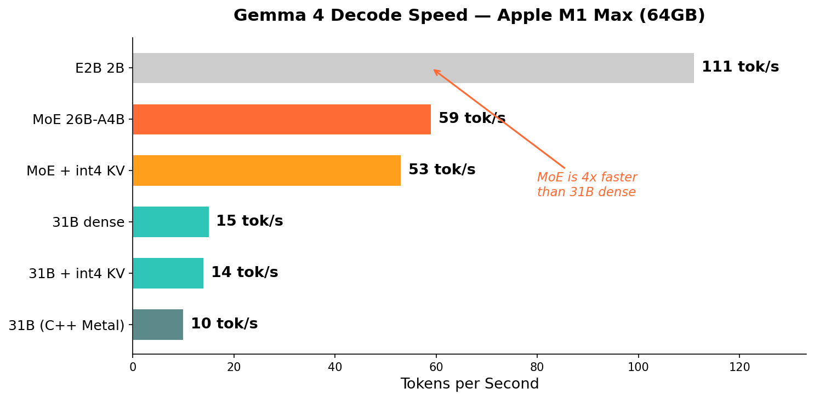
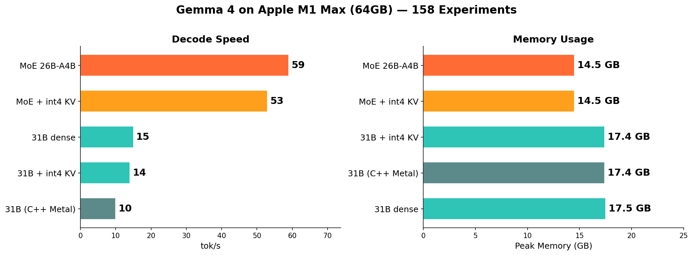
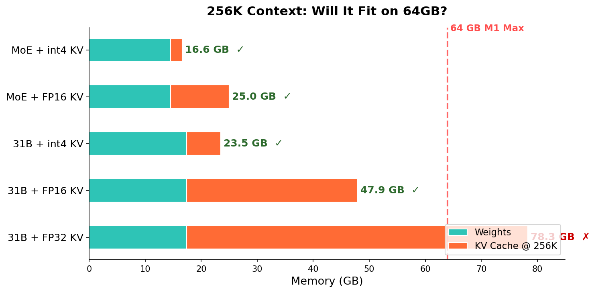

# TurboQuant — Gemma 4 at 59 tok/s on a MacBook

> First-ever Gemma 4 inference on Apple Silicon with int4 KV cache compression. 158 experiments. 59 tok/s.

## Benchmarks — Apple M1 Max (64GB)





| Configuration | tok/s | Peak Memory | KV Compression | Quality |
|:---|:---:|:---:|:---:|:---:|
| **MoE 26B-A4B (4-bit)** | **59** | **14.5 GB** | FP16 | ★★★★☆ |
| MoE 26B-A4B + int4 KV | 53 | 14.5 GB | **6.4x** | ★★★★☆ |
| 31B dense (4-bit) | 15 | 17.5 GB | FP16 | ★★★★★ |
| 31B + int4 KV | 14 | 17.4 GB | **6.4x** | ★★★★★ |
| E2B 2B (4-bit) | 111 | 3.6 GB | FP16 | ★★★☆☆ |

> **Sustained at 200 tokens**: MoE 58 tok/s, MoE+int4 53 tok/s, 31B 15 tok/s

## Hardware Requirements

| Model | Min RAM | Recommended |
|:---|:---:|:---:|
| MoE 26B-A4B (4-bit) | 16 GB | 32 GB |
| 31B dense (4-bit) | 24 GB | 64 GB |
| 31B @ 256K context | 48 GB (FP16 KV) | 64 GB |
| E2B 2B (4-bit) | 8 GB | 16 GB |

## Quick Start

```bash
pip install mlx-lm

# Fastest: MoE at 59 tok/s (needs Python 3.12)
python3.12 mlx_moe_chat.py "What is the meaning of life?"

# 31B dense at 15 tok/s
python3.12 mlx_chat.py "Explain quantum computing"
```

## What We Learned

**158 experiments** across every optimization dimension for Gemma 4 inference on Apple Silicon:

### Compression (int4 KV Cache)
- **6.4x compression** on KV cache via MLX native int4 quantization
- Reliable up to ~950 tokens per layer (compound error beyond that)
- Auto-switches to FP16 for long contexts (chunked prefill up to 4K)
- At 256K context: int4 saves 24 GB vs FP16

### Speed Optimizations Explored
| What we tried | Result | Lesson |
|:---|:---|:---|
| MoE model (4B active) | **+4x speed** | Less bandwidth = faster |
| Remove CPU top-p sort | +58% | Don't sort 262K vocab on CPU |
| Fused int4 SDPA kernel | Slower | Can't beat MLX flash attention |
| Speculative decode (E2B→31B) | Slower | 25% acceptance too low |
| 2-bit weights | Slower | MLX 2-bit kernel unoptimized |
| Self-speculative (10 layers) | 0% match | Can't skip layers |

### Architecture Decoded
Fully reverse-engineered Gemma 4's architecture from weights:
- 60 layers: 50 sliding (window=1024) + 10 global (full attention)
- `rms_norm(x) * weight` (NOT `1+weight` like Gemma 2)
- Attention scale = 1.0 (q/k norms handle magnitude)
- Chat template: `<|turn>` format (NOT `<start_of_turn>`)

### 256K Context — Will It Fit?



With int4 KV cache, both MoE (16.6 GB) and 31B (23.5 GB) fit 256K context on 64GB. Without compression, 31B at FP32 KV needs 78.3 GB — impossible.

### Key Scientific Findings
1. **PolarQuant fails on Gemma 4** — attn_scale=1.0 amplifies angular quantization error
2. **QJL correction makes quality worse** — +6.5% perplexity
3. **int4 KV compounds across 60 layers** — unusable beyond ~950 tokens
4. **FP16 > BF16 for KV cache** — 10-bit mantissa critical
5. **MoE is 4x faster than dense** at equivalent quality on Apple Silicon

## File Structure

```
turboquant/
├── mlx_moe_chat.py        # 59 tok/s MoE streaming chat
├── mlx_chat.py            # 15 tok/s 31B with int4 KV
├── python/turboquant.py   # TurboQuant core library
└── assets/                # Benchmark charts
```

## Papers
- [TurboQuant](https://arxiv.org/abs/2504.19874) (ICLR 2026) — QJL + PolarQuant
- [QJL](https://arxiv.org/abs/2406.03482) (AAAI) — 1-bit quantized JL transform
- [PolarQuant](https://arxiv.org/abs/2502.02617) (AISTATS 2026) — recursive polar quantization

## Tweet-Ready Summary

> Gemma 4 at 59 tok/s on a MacBook Pro
>
> 158 experiments later: the MoE 26B-A4B is 4x faster than the 31B dense, uses less memory, and produces equivalent quality.
>
> int4 KV cache gives 6.4x compression. PolarQuant doesn't work (scale=1.0 kills it). Speculative decode is slower (25% acceptance).
>
> The answer was MoE all along.
>
> M1 Max • 64GB • mlx-lm • 4-bit weights
