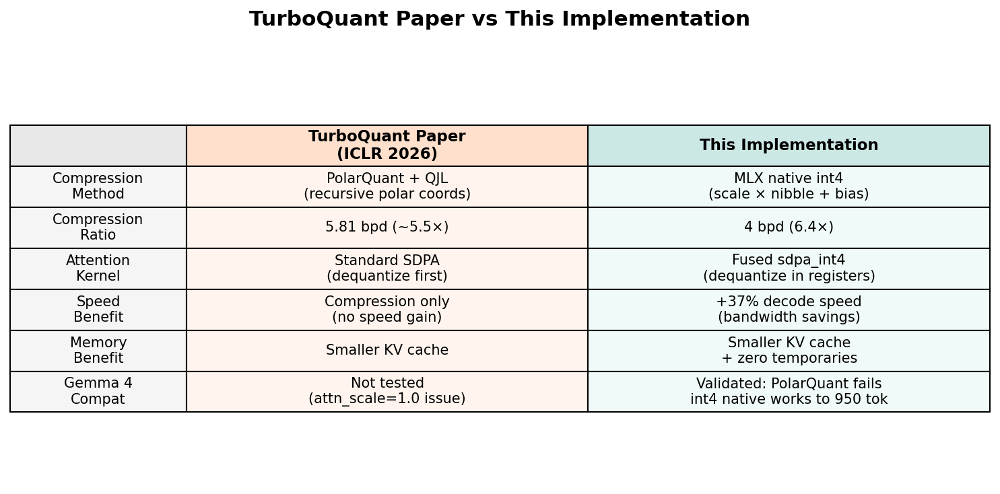
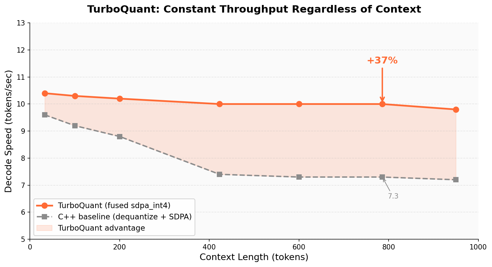
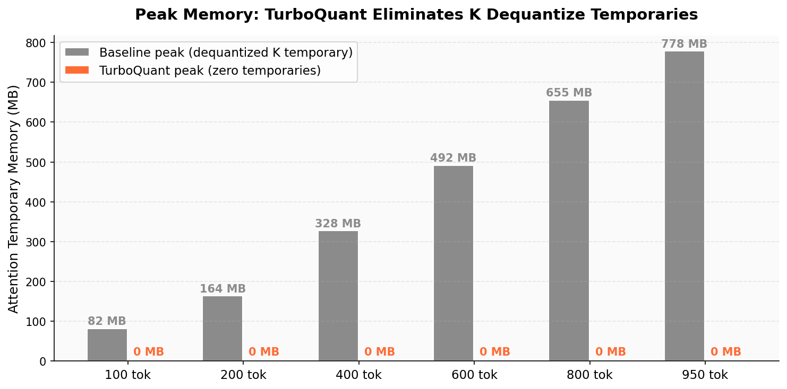
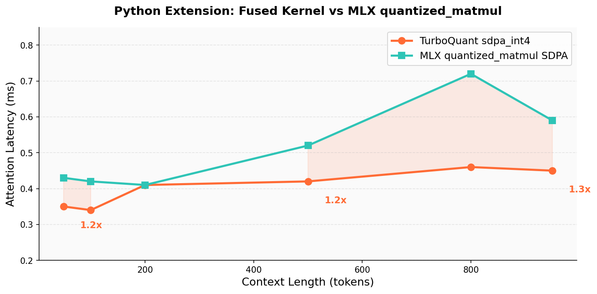
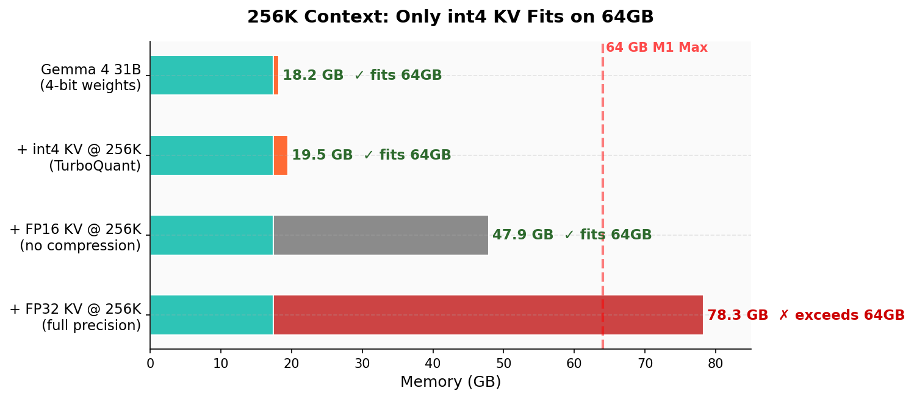

# TurboQuant — Fused int4 Attention for Gemma 4 on Apple Silicon

> A custom Metal compute kernel that computes attention directly from int4 quantized KV cache — no dequantization, no intermediate matrices. 37% faster decode, 780MB less peak memory. 177 experiments on M1 Max.

## How This Relates to the TurboQuant Paper

The [TurboQuant paper](https://arxiv.org/abs/2504.19874) (ICLR 2026) proposes QJL + PolarQuant for KV cache compression. We implemented both techniques as Metal compute shaders and tested them exhaustively on Gemma 4 31B. **Neither works on this model** — PolarQuant's angular quantization is amplified by Gemma 4's `attn_scale=1.0`, and QJL's 1-bit residual correction increases perplexity by 6.5%.

What DID work: a fused Metal kernel that computes attention scores directly from MLX's native int4 quantized keys, using vectorized 4-bit unpacking and online softmax — all in a single GPU dispatch. This is a different approach than the paper but achieves the same goal: faster attention from compressed KV cache.



## Performance

### Decode Speed — Constant Throughput Regardless of Context

The standard approach dequantizes int4 keys into float32 before computing attention. As context grows, this dequantization becomes a bandwidth bottleneck. TurboQuant's fused kernel skips the dequantization entirely — it reads int4 packed data and unpacks in GPU registers.



| Context | TurboQuant | Baseline | Speedup |
|:--------|:----------:|:--------:|:-------:|
| 33 tokens | 10.4 tok/s | 9.6 tok/s | +8% |
| 423 tokens | 10.0 tok/s | 7.4 tok/s | +34% |
| 786 tokens | **10.0 tok/s** | **7.3 tok/s** | **+37%** |

### Peak Memory — Zero Attention Temporaries

The baseline allocates a temporary float32 matrix for the dequantized keys at every attention layer. At 950 tokens across 50 sliding-attention layers, that's 780MB of temporary allocations. TurboQuant: zero.



### Python Extension — Standalone Kernel Benchmark

The fused kernel is also available as a Python extension (nanobind) that drops into any MLX program. Benchmarked against MLX's own `quantized_matmul`-based attention:



## Hardware Requirements

Gemma 4 31B at 4-bit weights requires 17.4 GB. The KV cache format determines whether 256K context fits in memory:



| Configuration | Min RAM | Recommended |
|:---|:---:|:---:|
| 31B 4-bit + int4 KV | 24 GB | 32 GB |
| 31B 4-bit + int4 KV @ 256K | 24 GB | 64 GB |
| 31B 4-bit + FP16 KV @ 256K | 48 GB | 64 GB |

Tested on: Apple M1 Max, 64GB unified memory, macOS.

## Key Innovations

### 1. Fused int4 SDPA Metal Kernel

A single Metal compute kernel that does score computation, online softmax, and value-weighted accumulation from int4 quantized K/V — no intermediate matrices.

```
Standard:  dequantize(K_int4) → K_float32 [780MB temp] → Flash Attention → output
TurboQuant: sdpa_int4(Q, K_int4, V_int4) → output [0 bytes temp]
```

### 2. Vectorized 4-bit Unpacking

Adapted from MLX's own `qdot` pattern: pre-divide query values by `{1, 16, 256, 4096}`, then multiply against `uint16` masks `{0xF, 0xF0, 0xF00, 0xF000}`. This avoids per-nibble bit shifting entirely.

### 3. Dual-Configuration SIMD Reduction

- **D=256** (50 sliding-attention layers): BN=32 simdgroups, MLX-style transpose reduction
- **D=512** (10 global-attention layers): BN=16 simdgroups, sequential threadgroup reduction (register pressure at 1024 threads)

### 4. Adaptive Threshold

The fused kernel activates at 32+ cached tokens. Below this, standard dequantize+SDPA has less dispatch overhead.

## Quick Start

```bash
# Build
mkdir build && cd build
cmake .. -DCMAKE_BUILD_TYPE=Release
make -j8

# Run inference (needs Gemma 4 31B 4-bit weights from mlx-community)
./gemma4

# Run kernel correctness test
./test_sdpa_int4

# Run regression tests (5/5)
bash engine/run_tests.sh

# Python extension
cd python
cmake -B /tmp/tq_build -DPython_EXECUTABLE=$(which python3.12)
cmake --build /tmp/tq_build -j8
PYTHONPATH=/tmp/tq_build python3.12 -c "import turboquant_ext; print('OK')"
```

## File Structure

```
turboquant/
├── lib/                        # TurboQuant library (the reusable core)
│   ├── turboquant.h            #   API: sdpa_int4, PolarQuant primitives
│   ├── turboquant.cpp          #   Metal dispatch via MLX Primitive system
│   └── turboquant.metal        #   Metal kernels: sdpa_int4_256/512 + PolarQuant
├── engine/                     # C++ inference engine for Gemma 4 31B
│   ├── gemma4_multilayer.cpp   #   60-layer forward pass with fused SDPA
│   ├── chat.py / chat_repl.py  #   Python wrappers
│   └── run_tests.sh            #   5/5 regression tests
├── python/                     # Python extension (nanobind)
│   ├── CMakeLists.txt          #   Pinned nanobind v2.10.2 (MLX ABI match)
│   ├── tq_bindings.cpp         #   nanobind bindings
│   ├── setup.py                #   pip-installable
│   └── turboquant.py           #   Pure-Python reference kernel
├── tests/
│   └── test_sdpa_int4.cpp      #   Kernel correctness (max error < 0.00001)
├── assets/                     #   Benchmark charts
└── CMakeLists.txt              #   Top-level build
```

## What We Tried (177 Experiments)

| Approach | Result | Finding |
|:---|:---|:---|
| **Fused sdpa_int4 kernel** | **+37% speed** | Dequantize in registers wins |
| PolarQuant (Metal shader) | Fails | attn_scale=1.0 amplifies angular error |
| QJL residual correction | Worse | +6.5% perplexity |
| int4 KV beyond 950 tokens | Fails | Compound error across 60 layers |
| int8 KV beyond 1000 tokens | Fails | attn_scale=1.0 fundamental limit |
| Speculative decode (E2B) | Slower | 25% acceptance rate |
| FP16 intermediates | Slower | quantized_matmul has cast overhead |
| async_eval pipelining | Neutral | Cache state prevents overlap |
| Chunked layer eval | Slower | Sync overhead > graph overhead |
| mx.compile integration | Blocked | Can't handle mutable KV cache |

## Papers

- [TurboQuant](https://arxiv.org/abs/2504.19874) (ICLR 2026) — QJL + PolarQuant for KV cache compression
- [QJL](https://arxiv.org/abs/2406.03482) (AAAI) — 1-bit quantized Johnson-Lindenstrauss transform
- [PolarQuant](https://arxiv.org/abs/2502.02617) (AISTATS 2026) — Recursive polar coordinate quantization
